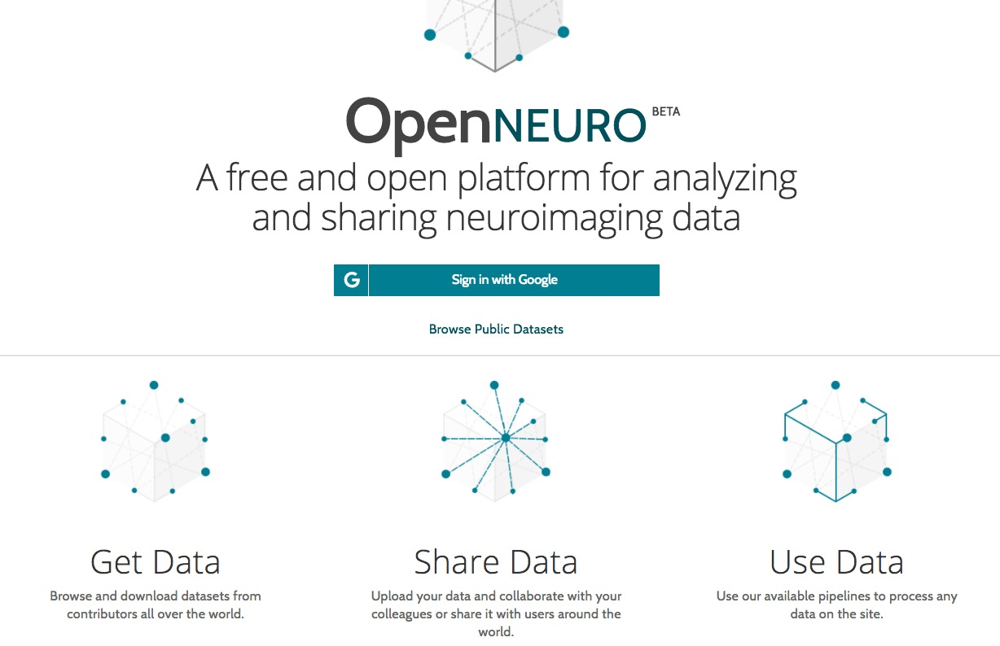
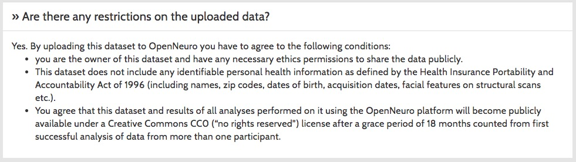
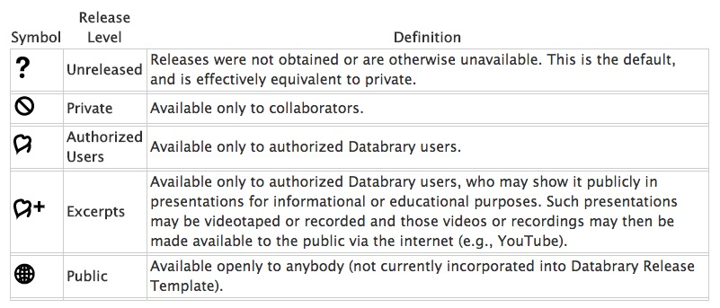
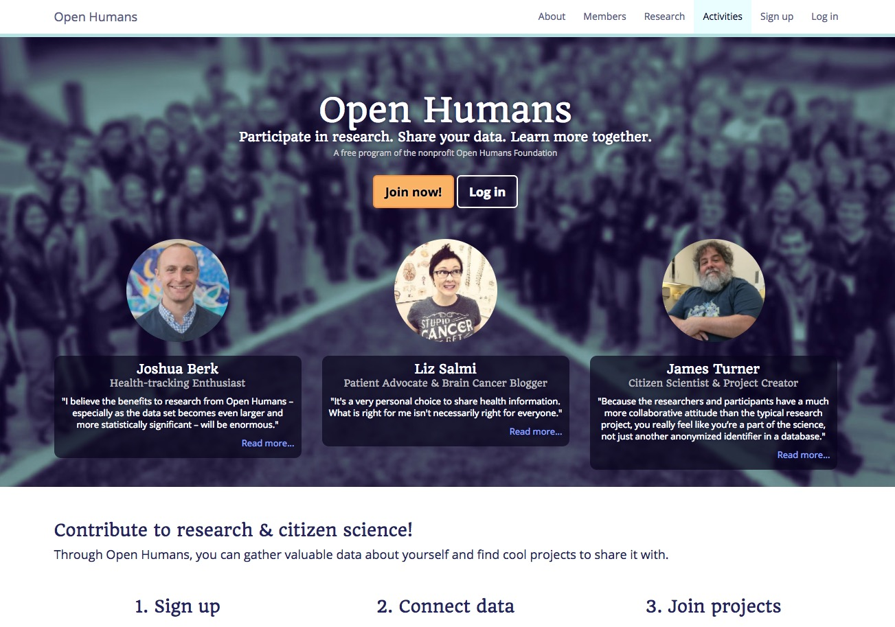
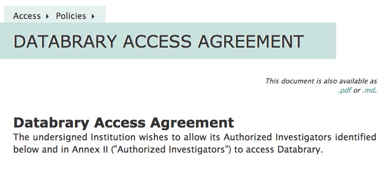
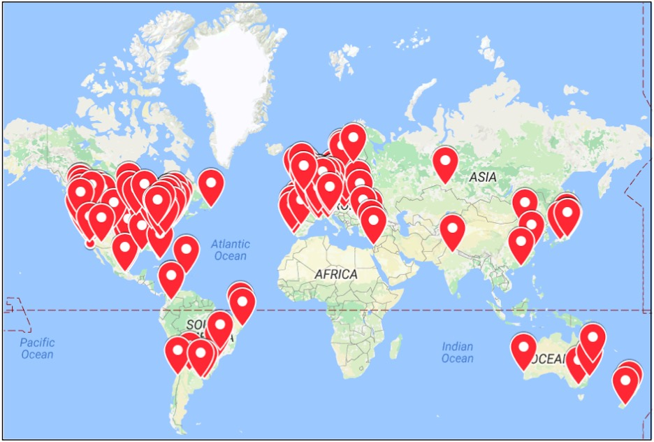
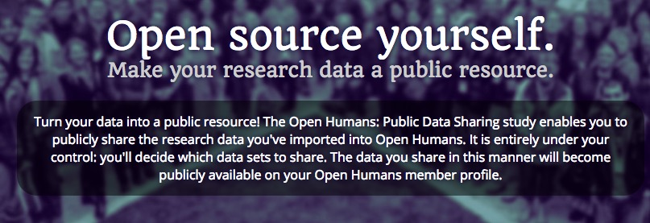
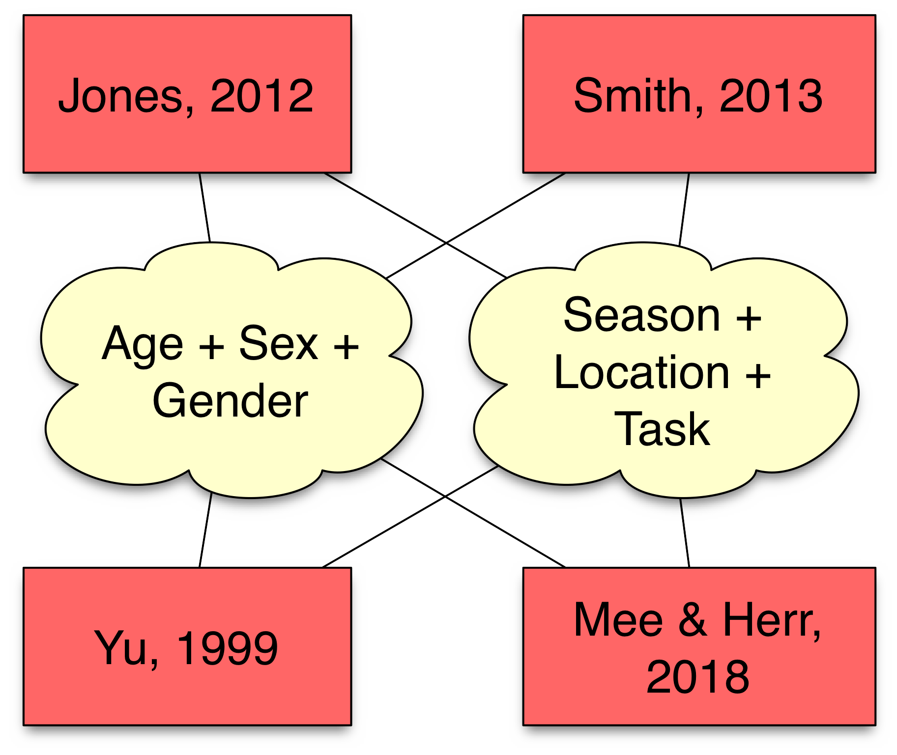

```{r setup, include=FALSE}
knitr::opts_chunk$set(echo = FALSE)
```

## IRBs & Data Sharing


- SIPS 2017
- 2017-07-30 3:30-4:45 pm

## Vision

- Make data from psychological research as widely available as possible

## Challenges in sharing data

- Data sharing may pose harm of loss of privacy & confidentiality

## Loss of privacy

>"Hey, Joe told me that you participated in his study of people who eat scorpions for breakfast."

## Loss of confidentiality

>"I saw the video on YouTube of you feeding scorpions to your roommate from that study. Whoa, pretty intense. It's gone viral. Did you know they were going to post it publicly?"

## Meeting the challenges

- What data are you collecting?
- What risks does it pose?
- How should it be protected?
- Tension between protecting participants and advancing scientific discovery

## Meeting the challenges

- Sharing de-identified data
- Sharing identifiable data

## Sharing de-identified data

- What is personally identifying information (PII)?
    - PII definitions vary by use case
    - Health Insurance Portability and Accountability Act (HIPAA) identifiers

<div class="notes">
In the U.S., much behavioral research is funded by the NIH and has at least a nominal relationship to health. So, the HIPAA identifiers serve as a guideline for PII.
</div>

## HIPAA identifiers

- Name
- Address (all geographic subdivisions smaller than state, including street address, city county, and zip code)
- All elements (except years) of dates related to an individual (including birthdate, admission date, discharge date, date of death, and exact age if over 89)
- Telephone
- Fax numbers
- Email address
- Social Security Number

---

- Medical record number
- Health plan beneficiary number
- Account number
- Certificate or licence number
- Any vehicle or other device serial number
- Web URL
- Internet Protocol (IP) Address

---

- Finger or voice print
- Photographic image - Photographic images are not limited to images of the face.
- Any other characteristic that could uniquely identify the individual

## Challenges with de-identifying data

- Dates (birth, test dates, exact age) extremely useful
- Geographic information extremely useful
- Video, audio recordings extremely useful

## Challenges with de-identifying data

- Risk of reidentification may be high anyway
    - de Montjoye, Y.-A., Radaelli, L., Singh, V. K., & Pentland, A. S. (2015). Identity and privacy. Unique in the shopping mall: on the reidentifiability of credit card metadata. Science, 347(6221), 536–539. Retrieved from http://dx.doi.org/10.1126/science.1256297
    - Gymrek, M., McGuire, A. L., Golan, D., Halperin, E., & Erlich, Y. (2013). Identifying personal genomes by surname inference. Science, 339(6117), 321-324.
    - Latanya Sweeney's Data Privacy Lab: https://dataprivacylab.org/people/sweeney/

## Sharing de-identified data

## [OpenNeuro.org](http://openneuro.org)

<div class="centered">
<a href="http://openneuro.org">

</a>
</div>

---

<div class="centered">
<a href="https://openneuro.org/faq">



</a>
</div>

---

<div class="centered">
<a href="https://openneuro.org/faq">

</a>
</div>

## Sharing identifiable data

- Open Humans
- Databrary.org

## [Databrary.org](http://databrary.org)

<div class="centered">

</div>

## [Databrary.org](http://databrary.org)

- Specializes in storing, sharing video
- Video captures behavior unlike other methods, but is *identifiable*
- Policy framework for sharing identifiable data
    + **Permission to share** -> builds on informed consent
    + **Restricted access** for (institutionally) authorized researchers
    
---

<div class="centered">
<a href="https://www.databrary.org/access/guide/investigators/release/release-levels.html">

</a>
</div>

## Open Humans

<div class="centered">
<a href="http://www.openhumans.org">

</a>
</div>

## Share with whom?

- By request, case-by-case
- Restricted sharing
- Public

---

<div class="centered">
<a href="https://www.databrary.org/access/policies/agreement.html">

</a>
</div>

<div class="notes">
Every researcher who wants access to Databrary must have formal written approval from their institution.
</div>

---

<div class="centered">

</div>

<div class="notes">
This is an extra step, but it protects participants, researchers, and institutions. The number and geographic diversity of the institutions that have signed on in just over 3 years tell us that it is not overly burdensome.
</div>

## Public sharing of identifiable data

<div class="centered">
<a href="https://www.openhumans.org/public-data/">

</a>
</div>

## Risks of public sharing

- Identity theft
- Embarrassment
- Discrimination
- Data may later become sensitive
- Can withdraw, but can't "unshare"

[Open Humans: Public Data Sharing Consent](https://www.openhumans.org/static/public-data/docs/Consent_Document_20160128_(stamped).005ab78912c1.pdf)

## Specific risks for sharing these data types

- Demographic data
- Genetic data
- Location data

[Open Humans: Public Data Sharing Consent](https://www.openhumans.org/static/public-data/docs/Consent_Document_20160128_(stamped).005ab78912c1.pdf)

## Who owns data?

- Investigators?
- Institutions?
- Taxpayers?
- Participants?

## Other pitfalls

- ~~Specific uses~~
- ~~Data destruction clauses~~
- Alert participants that data may be stored in "cloud" servers (e.g., SurveyMonkey, Qualtrics, Databrary, OpenNeuro, OSF, etc.)?

## Why bother?

- Reproducible and robust results
- Data reuse (leverages public investments)
- Data linkaage, aggregation, metaanalysis
    - Metadata matters!

---

<div class="centered">

</div>

## Society benefits

- Public data is a public resource 
- Serves diverse individuals not part of
standard research groups
- Participants can advance their own understanding

[Open Humans: Public Data Sharing Consent](https://www.openhumans.org/static/public-data/docs/Consent_Document_20160128_(stamped).005ab78912c1.pdf)

## Best practices

- Preparing for sharing
    - Get IRB approval
    - Get participant approval
- Eliminate "don't have permission" as a barrier to sharing

## Resources

- Schönbrodt, F., Gollwitzer, M. & Abele-Brehm A. (2016). Data Management in Psychological Science: Specification of the DFG Guidelines. <http://www.dgps.de/fileadmin/documents/Empfehlungen/Data_Management_eng_9.11.16.pdf>
- **C**onnected and **O**pen **R**esearch **E**thics (CORE). <https://thecore.ucsd.edu/>.