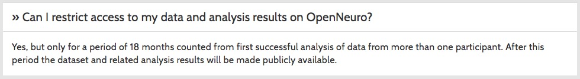

```{r setup, include=FALSE}
knitr::opts_chunk$set(echo = FALSE)
```

## IRBs & Data Sharing

<div class="centered">


**2017-07-30 3:30-4:45 pm**

See <http://osf.io/9d5hr/>
</div>

## Vision

- Make data from psychological research as widely available as possible
    - Increase reuse potential
    - Reduce bias risk
    - Make published analyses transparent
- Avoid causing harm to research participants

## Roadmap

- Ethical challenges in sharing data
- Sharing de-identified data
- Sharing identifiable data

# Ethical challenges in sharing data

## [Belmont principles](https://www.hhs.gov/ohrp/regulations-and-policy/belmont-report/index.html)

- **Beneficence**
    - Data sharing increases value (good)
    - Data sharing may pose risk of loss of privacy & confidentiality (bad)
- **Autonomy**
    - Data sharing may pose risk of unintended use of data

---

- **Justice**
    - Benefits (and costs) of research participation should be equitable

## Meeting the challenges

- Tension b/w protecting participants & advancing discovery
- Tension b/w requirements/expectations/desires to share and practical, regulatory/legal, ethical constraints

## What data are you collecting?

- Personally identifying or sensitive data?
- What risks does data sharing pose?
- How should data be protected?

## Where will you share data?

- Researcher/lab/university server
- Supplemental material linked to journal article
- Data repository

## Who will (& should) have access?

- Public
- Community of authorized individuals (researchers)
- Individuals selected by data owner or repository

## What have participants been told, approved?

- What data collected, shared
- Who will have access
- Where stored, how accessed
- Purposes of use, types of questions

# Sharing de-identified data

## What is personally identifying information (PII)?

- PII definitions vary by use case
- Health Insurance Portability and Accountability Act (HIPAA) identifiers

<div class="notes">
In the U.S., much behavioral research is funded by the NIH and has at least a nominal relationship to health. So, the HIPAA identifiers serve as a guideline for PII.
</div>

## HIPAA identifiers

- Name
- Address (all geographic subdivisions smaller than state, including street address, city county, and zip code)
- All elements (except years) of dates related to an individual (including birthdate, admission date, discharge date, date of death, and exact age if over 89)

---

- Telephone
- Fax numbers
- Email address
- Social Security Number

---

- Medical record number
- Health plan beneficiary number
- Account number
- Certificate or license number
- Any vehicle or other device serial number
- Web URL
- Internet Protocol (IP) Address

---

- Finger or voice print
- Photographic image - Photographic images are not limited to images of the face.
- Any other characteristic that could uniquely identify the individual

## Examples of possibly sensitive data

- Health related information
    - Medical history
    - Medical risk factors including genetic data
    
---

- Information about other potentially stigmatizing characteristics (situation-dependent)
    - Religious/philosophical convictions
    - Sexual identity and preferences
    - Political affiliation, trade union membership
    - Ethnicity, nationality, citizenship status

## Weighing benefits (of sharing) vs. risks

- How useful are data?
- How sensitive are data?
- How likely is it that reidentification could be achieved, and by whom?

## Risk scenarios

- Reidentification by participants themselves
    - Can be harmful e.g. if dataset contains uncommunicated health risk information
- Reidentification by insider
- Reidentification by targeted search (nemesis scenario)
- Reidentification by mass matching (dystopian AI scenario)

## How anonymous is 'anonymous' data?

---

<div class="centered">
<a href="http://dx.doi.org/10.1126/science.1256297">

</a>
</div>

---

<div class="centered">
<a href="http://dx.doi.org/10.1126/science.1229566">

</a>
</div>
    
---

<div class="centered">
<a href="https://dataprivacylab.org/projects/identifiability/paper1.pdf">

</a>

Name + DOB + ZIP uniquely identifies most Americans
</div>

<!-- --- -->

<!-- <div class="centered"> -->
<!-- <a href="https://papers.ssrn.com/sol3/papers.cfm?abstract_id=1450006"> -->
<!--  -->
<!-- </a> -->
<!-- </div> -->

## Ways to mitigate risk

- Aggregate or censor sensitive variables
- Aggregate or censor secondary identifying variables
- Stepped or restricted access
- See also de Wolf et al. ([2005](http://www.jstor.org/stable/3563537), [2006](https://www.ncbi.nlm.nih.gov/pubmed/16770883))

## Information to participants

- **Do**:
    - Describe how you will share data in as much detail as possible (autonomy)
    - Give motivation for recording of sensitive variables (beneficence)
    
---

- **Avoid**:
    - Making promises you cannot keep, e.g. *"no one except the researchers in the project will ever see the data"*
    - Making unneccessary restrictions, e.g. *"your data will be stored for ten years then be destroyed"*
    
## Example language for consent forms

- [ICPSR](https://www.icpsr.umich.edu/icpsrweb/content/datamanagement/confidentiality/conf-language.html)
- [Open Brain consent](https://open-brain-consent.readthedocs.io/en/latest/#)
- [Draft language from Penn State IRB](https://osf.io/9d5hr/wiki/home/)

## Case study: [OpenNeuro.org](http://openneuro.org)

<div class="centered">
<a href="http://openneuro.org">

</a>
</div>

---

<div class="centered">
<a href="https://openneuro.org/faq">


</a>
</div>

---

<div class="centered">
<a href="https://openneuro.org/faq">

</a>
</div>

# Sharing *identifiable* data

## [Canadian Policy](http://www.pre.ethics.gc.ca/eng/policy-politique/initiatives/tcps2-eptc2/chapter5-chapitre5/#toc05-1e)

- Ethics board review **not required** for research that relies exclusively on secondary use of *anonymous* information
- [*"**Secondary data** refers to data that was collected by someone other than the user. Common sources of secondary data for social science include censuses, information collected by government departments, organisational records and data that was originally collected for other research purposes."*](https://en.wikipedia.org/wiki/Secondary_data)

---

- Researchers must obtain consent for secondary use of *identifiable* data **unless**
    - identifiable information is essential to the research;
    - use of identifiable information without consent is unlikely to adversely affect participants
    - researchers take appropriate measures to protect privacy of individuals and safeguard identifiable information
    
---

- Researchers must obtain consent for secondary use of *identifiable* data **unless**
    - researchers comply with any known preferences previously expressed by individuals about any use of their information
    - it is impossible or impracticable to seek consent
    - researchers have obtained any other necessary permission for secondary use of information for research purposes.

<http://www.pre.ethics.gc.ca/eng/policy-politique/initiatives/tcps2-eptc2/chapter5-chapitre5/>

## Case studies in sharing identifiable data

- [Databrary.org](http//databrary.org)
- [Open Humans](https://www.openhumans.org/) 

## [Databrary.org](http://databrary.org)

<div class="centered">

</div>

## [Databrary.org](http://databrary.org)

- Specializes in storing, sharing video
- Video captures behavior more fully than other methods, but is *identifiable*
- Policy framework for sharing identifiable data
    + **Permission to share** -> builds on informed consent
    + **Restricted access** for (institutionally) authorized researchers
    
---

<div class="centered">
<a href="https://www.databrary.org/access/guide/investigators/release/release-levels.html">

</a>
</div>

## Seeking [permission to share](https://www.databrary.org/access/guide/investigators/release.html)

<div class="centered">
<video controls>
  <source src="mov/example-video-1.mp4" type="video/mp4">
Your browser does not support the video tag.
</video>
</div>

---

<div class="centered">
<a href="https://www.databrary.org/access/policies/agreement.html">

</a>
</div>

<div class="notes">
Every researcher who wants access to Databrary must have formal written approval from their institution.
</div>

## Lessons learned

- Research consent ≠ permission to share
- "Cloud" storage vs. institutionally housed
- Comfort with data sharing varies among IRBs
- Laws differ among countries

<div class="notes">
In securing agreements with more than 330 institutions, we've learned some valuable lessons.
One is to try to keep separate the consent to participate in research from the permission to share data.
The risks and benefits differ.
Participants more informed about what they're sharing *after* a session has ended.
A second is that some institutions distinguish between data stored in the cloud like OSF or Databrary from data stored on servers the institution controls.
A third is that IRBs, like the local communities they are intended to reflect, differ.
Some aren't comfortable with Databrary's distributed model of responsibility and won't let their researchers participate.
And finally, national laws differ.
Some researchers can't store identifiable data on U.S. servers.
</div>

## Open Humans

<div class="centered">
<a href="http://www.openhumans.org">

</a>
</div>

## Public sharing of identifiable data

<div class="centered">
<a href="https://www.openhumans.org/public-data/">

</a>
</div>

## Risks of public sharing

- Identity theft
- Embarrassment
- Discrimination
- Data may later become sensitive
- Can withdraw, but can't "unshare"

[Open Humans: Public Data Sharing Consent](https://www.openhumans.org/static/public-data/docs/Consent_Document_20160128_(stamped).005ab78912c1.pdf)

## Specific risks for sharing these data types

- Demographic data
- Genetic data
- Location data

[Open Humans: Public Data Sharing Consent](https://www.openhumans.org/static/public-data/docs/Consent_Document_20160128_(stamped).005ab78912c1.pdf)

## Benefits of public sharing

- Public data as a public resource 
- Serves diverse individuals not part of
standard research groups
- Participants can advance their own understanding

[Open Humans: Public Data Sharing Consent](https://www.openhumans.org/static/public-data/docs/Consent_Document_20160128_(stamped).005ab78912c1.pdf)

# Recommendations

## Best practices to adopt

- **Prepare for sharing**
    - Get IRB/ethics board approval 
    - Get participant approval (even if planning to anonymize)

---

- **Alert participants**
    - **Where** data will be stored 
        - e.g. in "cloud" servers (e.g., SurveyMonkey, Qualtrics, Databrary, OpenNeuro, OSF, etc.)
        - Be explicit, but not specific
    - **Who** will have access
    - And for **how long**
        - indefinitely
        - stopping sharing possible, unsharing not-so
    
---

- **Share as openly as practicable**
    - With approved, authorized data repositories

## Pitfalls to avoid

- ~~Specific use cases for data~~
    - *"Your data will be used to study the relationship between X and Y."*
- ~~Data destruction clauses~~
    - *"Your data will be stored for X years then destroyed."*
    - **NOT REQUIRED by U.S. or Canadian law**
    
# Discussion

## Issues

- Sponsor requirements (or constraints) vs. open sharing
- Do IRBs overstep regulatory boundaries when considering risks and benefits outside an approved study [(Burnam, 2014)](http://osc.centerforopenscience.org/2014/02/05/open-data-and-IRBs)?
- Policies for restricting access but promoting openness
- Who owns data

# Resources

<!-- Scrolling final reference page -->
<!-- http://stackoverflow.com/q/38260799 -->
<!-- <style> -->
<!-- slides > slide { overflow: scroll; } -->
<!-- slides > slide:not(.nobackground):before { -->
<!--   background: none; -->
<!--   } -->
<!-- slides > slide:not(.nobackground):after { -->
<!--   content: ''; -->
<!--   background: none; -->
<!--   } -->
<!-- } -->
<!-- </style> -->

## Stack

This talk was produced on `r Sys.Date()` in [RStudio 1.0.143](http://rstudio.com) using R Markdown. 
The code and materials used to generate the slides may be found at <https://github.com/gilmore-lab/sips-2017-07-30/>. 
An OSF wiki is [here](https://osf.io/9d5hr/wiki/home/).
Information about the R Session that produced the code is as follows:

---
<!-- Scrolling final reference page -->
<!-- http://stackoverflow.com/q/38260799 -->
<!-- <style> -->
<!-- slides > slide { overflow: scroll; } -->
<!-- slides > slide:not(.nobackground):before { -->
<!--   background: none; -->
<!--   } -->
<!-- slides > slide:not(.nobackground):after { -->
<!--   content: ''; -->
<!--   background: none; -->
<!--   } -->
<!-- } -->
<!-- </style> -->

```{r session-info}
sessionInfo()
```
